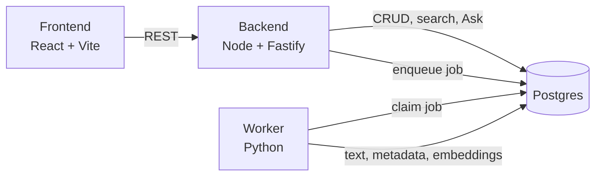

# Personal Document Manager

A private, single-user place for your important documents. Upload a PDF or image, let AI pull out its structure, then **ask questions across your whole collection** instead of opening files one by one.

> **Store → Understand → Index → Ask → Act**

## What it does

The goal: find and understand personal information without navigating a pile of documents.

| Step           | What happens                                                                                |
| -------------- | ------------------------------------------------------------------------------------------- |
| **Upload**     | Store PDF/image documents, with basic categories, tags and metadata.                        |
| **Understand** | AI classifies each document and extracts type, entities, dates and obligations.             |
| **Ask**        | Natural-language questions across the collection, e.g. _"Where is my employment contract?"_ |
| **Find**       | Answers link back to the source document, and to the page/section where feasible.           |
| **Act**        | Track deadlines and actions; surface upcoming and overdue ones with basic reminders.        |

**Principles:** personal first · reduce navigation · AI with a purpose · source-aware answers · human control (extracted data stays reviewable and editable) · small but serious (realistic for one developer).

**Deliberately not in the MVP:** a generic chatbot, a Drive/Dropbox/Notion replacement, email or bank integration, an autonomous agent, legal advice, or a multi-user platform.

## Architecture

A modular monolith split by _workload_, not by microservice. Fast, synchronous work lives in the Node API; slow per-document work runs in a Python worker. **Postgres is the only queue or broker they need.**

| Component    | Path                                     | Responsibility                                                                          |
| ------------ | ---------------------------------------- | --------------------------------------------------------------------------------------- |
| Backend      | [`apps/backend`](apps/backend/README.md) | CRUD, auth, search and the synchronous Ask/RAG endpoint. Fastify + TypeScript.          |
| Worker       | `apps/worker`                            | Async pipeline: OCR/text extraction, classification and extraction via LLM, embeddings. |
| Frontend     | `apps/frontend`                          | React + Vite UI.                                                                        |
| Shared types | `packages/shared`                        | TypeScript types shared between frontend and backend.                                   |

### Decisions and why

| Decision                                                           | Why                                                                                                                                                                     |
| ------------------------------------------------------------------ | ----------------------------------------------------------------------------------------------------------------------------------------------------------------------- |
| **Node API + separate Python worker**                              | Node for the everyday API; Python for OCR and AI, where its ecosystem is stronger.                                                                                      |
| **Postgres is the queue** (`jobs` table, `FOR UPDATE SKIP LOCKED`) | No Redis or broker. BullMQ's Python client is not well maintained, and one less piece of infrastructure suits a solo project. Adding a broker needs a discussion first. |
| **Ask/RAG is synchronous, in the backend**                         | It must answer in real time, so it never goes through the job queue. Slow per-document work always does.                                                                |
| **Answers carry their source**                                     | Every search result or answer returns a `document_id` (plus page/section where available), not just prose.                                                              |
| **Extracted metadata stays correctable**                           | Once a user edits an extracted value, re-processing must not silently overwrite it.                                                                                     |
| **Deadline detection is best-effort**                              | It is a harder problem than classification, so manual create/edit is the reliable path and detection is a bonus.                                                        |
| **LLM: Claude API; embeddings: Voyage AI**                         | Anthropic has no first-party embeddings endpoint.                                                                                                                       |
| **Uploaded files on local disk** (`STORAGE_DIR`)                   | Simplest for a solo, single-host deployment. **Assumes backend and worker mount the same path** — revisit (e.g. object storage) if they ever run on separate hosts.     |

**Not decided yet:** how embeddings are stored and searched, the auth model, and whether OCR ships in the MVP (scanned images are unsearchable without it). Each gets decided in the ticket that first needs it.

## Getting started

Each app documents its own setup in its README:

- **Backend**: [apps/backend/README.md](apps/backend/README.md)
