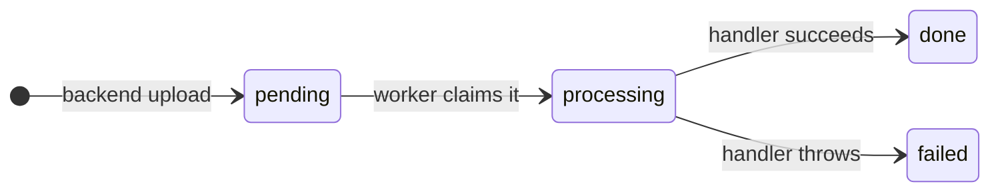

# Worker

The background worker of the [Personal Document Manager](../../README.md), built with Node and TypeScript. It processes the jobs the backend queues on upload.

## Getting started

Requires Docker and the Node version in `package.json` (`engines`). Set up the [backend](../backend/README.md) first, including its database and migrations: the worker shares its database and storage. Then run everything from this directory.

```bash
cp .env.example .env   # then set ANTHROPIC_API_KEY
npm run dev
```

All scripts are in `package.json`.

## How it works

The queue is the `jobs` table: the backend inserts a `pending` job on every upload, and the worker processes it. A job's `status` only moves forward, never back to `pending`, so each job is attempted at most once:



The worker is one loop:

1. **Claim** the oldest pending job ([`claimJob`](src/queue.ts)).
2. **Handle** it with the function for its `job_type` ([`handleJob`](src/handlers.ts)).
3. **Finish** by recording `done` or `failed` ([`runOnce`](src/worker.ts)).
4. **Repeat** right away if there was a job. Otherwise sleep `POLL_INTERVAL_MS` and check again ([`pollJobs`](src/worker.ts)).

The `extract` handler saves a document's text, one row per page in `document_pages`:

- **PDF**: the text layer is read locally, and Claude never sees the file. Only when no page has a text layer (a scan) does the PDF go to Claude for OCR.
- **Image** (JPEG, PNG): goes straight to Claude for OCR, as one page.

OCR sends the file to Anthropic and costs money: about €0.015 per dense page.

When something goes wrong:

| Situation                                        | What the worker does                                                                                   |
| ------------------------------------------------ | ------------------------------------------------------------------------------------------------------ |
| A handler throws (missing file, unknown type, …) | Marks the job `failed`, saves the error's message in `jobs.error`, logs it and moves on.               |
| OCR fails (network, rate limit, bad key)         | The SDK retries network errors, 429 and 5xx twice; then the job is `failed` with `OCR request failed`. |
| OCR stops early or returns the wrong page count  | The job is `failed` with `OCR stopped early: …` or `OCR returned N pages, expected M`.                 |
| The database is unreachable                      | Logs `Polling failed`, sleeps `POLL_INTERVAL_MS` and tries again until the database is back.           |
| Ctrl+C or SIGTERM                                | Stops polling, lets the current job finish, then exits.                                                |
| The worker crashes mid-job                       | The job stays `processing`; nothing picks it up again (see the `MVP:` note on `claimJob`).             |

## Testing by hand

Run the backend (`npm run dev` in `apps/backend`) and the worker (`npm run dev` here), and open a database shell:

```bash
docker compose -f ../../infra/db/docker-compose.yml exec postgres psql -U postgres -d personal_document_manager
```

Watch the queue with:

```sql
select id, document_id, job_type, status, error from jobs order by created_at;
```

And the extracted text with:

```sql
select document_id, page_number, left(text, 80) from document_pages order by document_id, page_number;
```

| Scenario      | Do                                                                                                                            | Expect                                                                                                    |
| ------------- | ----------------------------------------------------------------------------------------------------------------------------- | --------------------------------------------------------------------------------------------------------- |
| Processed     | Upload the sample PDF with the backend's [`requests.http`](../backend/requests.http).                                         | Log `Job … (extract) done`; status `done`; one `document_pages` row per page.                             |
| Image         | Upload `samples/photo.jpg` with the backend's `requests.http`.                                                                | Status `done`; one `document_pages` row with the image's text.                                            |
| Scanned PDF   | Upload `samples/scanned.pdf` (no text layer).                                                                                 | Status `done`; one row per page with the transcribed text.                                                |
| OCR failure   | Set `ANTHROPIC_API_KEY=invalid` in `.env`, restart the worker, upload an image.                                               | Status `failed`, `error` is `OCR request failed`.                                                         |
| Queued        | Stop the worker, upload, check the queue, start the worker.                                                                   | `pending` while the worker is stopped, then `done`.                                                       |
| Failed        | Stop the worker, upload, delete the file named after the document id in `STORAGE_DIR`, start the worker.                      | Log `… failed: Error: ENOENT …`; status `failed`, `error` starts with `ENOENT`; the worker keeps polling. |
| Unknown type  | `insert into jobs (document_id, job_type) select id, 'bogus' from documents limit 1;`                                         | Rejected by the database: `violates check constraint "jobs_job_type_check"`.                              |
| Re-run a job  | `update jobs set status = 'pending', error = null where id = '<job id>';`                                                     | The worker processes it again.                                                                            |
| Database down | `docker compose -f ../../infra/db/docker-compose.yml stop postgres`, wait a few seconds, then `start postgres`; re-run a job. | `Polling failed` once per interval, not a flood; the re-run job ends `done`.                              |
| Shutdown      | Ctrl+C in the worker's terminal.                                                                                              | Log `Worker stopped`.                                                                                     |

For a clean slate, `npm run data:reset` wipes all data and stored files.
